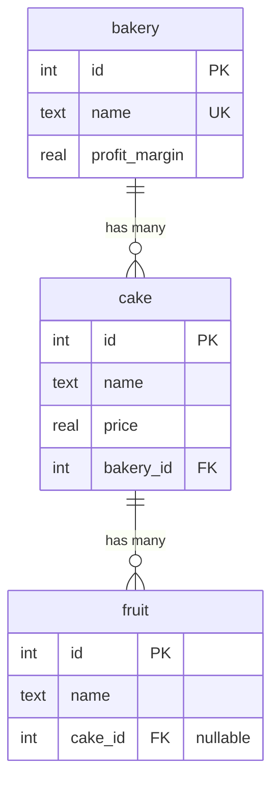

# Relations

A relation tells the ORM how two tables join: which columns match, which
side owns the foreign key, and what happens on delete or update. One
declaration serves three purposes at once: the `JOIN ... ON` clause of a
query, the batch loaders, and the `FOREIGN KEY` constraint in the
generated DDL. This page explains how to declare relations, the ways to
read across them, and how the less common shapes are handled: tables that
meet through a junction, a table that refers to itself, two relations to
the same table, and paths that cross several tables.

## The example schema

The basic example uses three tables. A bakery owns cakes; a cake carries
fruits; a fruit may sit on no cake at all.



## Declaring a relation

Relations live in the `Relation` enum next to the model. The rule that
makes declarations short: **the side that holds the foreign key declares
it in full, the other side only points back**.

The owning side uses `belongs_to` and names its own column (`from`) and
the column it references (`to`):

```rust
--8<-- "examples/basic/src/entity/fruit.rs"
```

The reverse side uses `has_many` or `has_one` and gives only the target
entity. The macro finds the matching `belongs_to` on that entity and
reuses its columns, so the join condition is written once:

```rust
--8<-- "examples/basic/src/entity/bakery.rs"
```

| Attribute | On which side | Effect |
|---|---|---|
| `belongs_to = "path::Entity"` | The table holding the foreign key | Declares the many-to-one relation and generates the `FOREIGN KEY` clause. |
| `from = "Column::X"`, `to = "path::Column::Y"` | With `belongs_to` | The local column and the referenced column; repeat both for a composite key. |
| `on_delete`, `on_update` | With `belongs_to` | `Cascade`, `SetNull`, `Restrict`, `NoAction` or `SetDefault`, rendered into the constraint. |
| `skip_fk` | With `belongs_to` | Keeps the relation for queries but emits no constraint, for tables you do not control. |
| `has_many = "path::Entity"` | The referenced table | One-to-many, columns inferred from the reverse `belongs_to`. |
| `has_one = "path::Entity"` | The referenced table | One-to-one, same inference. |
| `via = "path::JunctionEntity"` | With `has_many` | Many-to-many through the junction entity, explained [below](#many-to-many-through-a-junction). |

`fruit.cake_id` is an `Option<i32>`, so the column is nullable and
`ON DELETE SET NULL` is a sensible action: deleting a cake detaches its
fruits. `cake.bakery_id` is a plain `i32` with `ON DELETE CASCADE`:
deleting a bakery deletes its cakes. The engine enforces both because the
pool opens every connection with `PRAGMA foreign_keys = ON`, which
`ConnectOptions::foreign_keys` controls.

!!! note "Index your foreign keys"
    SQLite does not index foreign-key columns automatically, and every
    `find_related`, loader and cascade filters on them. Mark them
    `#[turso(indexed)]`, as `cake.bakery_id` is, so that
    `Schema::create_index_from_entity` emits the index.

## Reading across a relation

There are five ways, and they differ in how many queries run and in what
shape the result takes. Pick by what you have in hand.

```rust
--8<-- "examples/basic/src/query.rs:relations"
```

### From one model: `find_related`

`model.find_related(Other)` returns a `Select<Other>` already filtered on
the key of `model`. It works in both directions: a bakery finds its
cakes, a fruit finds its cake. Being a `Select`, it accepts every builder
method, so ordering or a further filter can be added before `all` or
`one`. It costs one query per call, which is fine for a single model and
is exactly the N+1 pattern to avoid inside a loop.

### Both sides in one query: `find_also_related`

`Entity::find().find_also_related(Other)` turns the select into a
`SelectTwo`: a `LEFT JOIN` whose rows decode into
`(Model, Option<Other::Model>)`. Under the hood the two column lists are
aliased `A_<col>` and `B_<col>` so that identically named columns do not
collide, and a right side made only of `NULL`s becomes `None`, which is
how a fruit without a cake comes back. One query, pairs in return.
`order_by_related` orders by a column of the other side.

### One entry per model: `find_with_related`

For a `has_many`, pairs repeat the left side once per related row.
`find_with_related(Other)` runs the same joined statement and folds the
rows into `Vec<(Model, Vec<Other::Model>)>`: each model once, identified
by its primary key, with its related models in row order. An `ORDER BY`
on the model orders the groups and one on the other side orders inside
each group. `LIMIT` is deliberately absent here, because it would count
joined rows rather than models; use the loaders for a paged list.

### Filtering on the other table: joins

`inner_join(Other)` and `left_join(Other)` add the join without changing
the selected columns. The result is still `Select<Entity>`, but filters
can now mention the other entity's columns, as in "fruits whose cake costs
more than nine". Because every column is rendered qualified, `fruit.id`
and `cake.id` never clash. `join(kind, &Relation::X.def())` does the same
for a relation that `Related` does not name, and `join_as` lets you pick
the alias of the joined table.

### Many models at once: the loaders

When you already hold a `Vec` of models and want their related rows, the
loaders fetch everything in one `WHERE key IN (...)` query and hand the
result back aligned with your input:

```rust
--8<-- "examples/basic/src/query.rs:loaders"
```

`load_many(Other, db)` returns `Vec<Vec<Other::Model>>`, one inner vector
per input model, in the same order; `load_one(Other, db)` returns
`Vec<Option<Other::Model>>`. Zipping the input with the result pairs them
back without a lookup table. This is the tool for list endpoints: one
query for the page of cakes, one for all their fruits, whatever the page
size.

| Call | Queries | You have | You get |
|---|---|---|---|
| `model.find_related(Other)` | one per call | one model | a `Select<Other>` to run |
| `find_also_related(Other)` | one | nothing yet | `Vec<(Model, Option<Other>)>` |
| `find_with_related(Other)` | one | nothing yet | `Vec<(Model, Vec<Other>)>` |
| `inner_join` / `left_join` | one | nothing yet | `Vec<Model>`, filtered on the other table |
| `load_one` / `load_many` | one | a `Vec<Model>` | related rows aligned with the input |

## Many-to-many through a junction

Two tables that can each refer to many rows of the other meet in a third
one, the junction, that holds one row per pair. The junction is an
ordinary entity with a composite key and a `belongs_to` towards each
side:

```rust
--8<-- "crates/turso-orm/examples/relations.rs:junction"
```

Each side then declares a `has_many` to the other with `via` naming the
junction. Nothing else is written: the two hops are assembled from the
junction's own `belongs_to` relations.

```rust
--8<-- "crates/turso-orm/examples/relations.rs:relations"
```

Every way of reading across a relation follows the two hops on its own.
`find_related` joins the junction and pins its column; the joins and
`find_also_related` join the junction and then the target;
`find_with_related` groups per model; `load_many` fetches the target rows
together with the junction columns that point back at the input and
groups on those, still in one query. `load_many_to_many` is the same
loader under a name that states the intent, and fails on a relation
without a junction.

```rust
--8<-- "crates/turso-orm/examples/relations.rs:many_to_many"
```

The `via` relation generates no foreign key of its own: the junction's
`belongs_to` relations already carry the two constraints, with the
`ON DELETE CASCADE` that removes the pair rows when either side goes.

## A table that refers to itself, and two relations to one table

A reply points at the post it answers; a post has an author and may have
an editor, both in `author`. Both shapes are declared like any other
relation, and both run into the same rule: Rust allows one
`Related<Target>` impl per entity, so the **first variant naming a target
is the one `find_related`, the joins and the loaders use**. The other
variants keep their definition, reachable through `Relation::X.def()`:

- `Select::related_to(&def, &model)` filters a query on `model` through
  that definition, which is the explicit form of `find_related`. For the
  reverse side of a self-reference, pass the `has_many` definition; for a
  second `belongs_to`, pass its definition reversed with `.rev()` and the
  model of the target.
- `Select::join_as(kind, &def, "alias")` joins through that definition
  under an alias that filters can name with `Expr::col(("alias", "column"))`.

```rust
--8<-- "crates/turso-orm/examples/relations.rs:self_reference"
```

When a join brings the base table in a second time, as a self-join does,
the second occurrence is aliased `table_1` automatically and the `ON`
condition is rendered against that alias, so the statement stays
unambiguous without any help. `find_also_related(post::Entity)` on a
post therefore yields `(reply, Some(parent))` pairs out of the box.

## Paths across several tables: `Linked`

Some questions cross more than one relation: the tags of every post an
author wrote, the bakeries whose cakes carry a given fruit. A `Linked`
chain names the hops once, as a unit struct, and every hop is a relation
definition you already have:

```rust
--8<-- "crates/turso-orm/examples/relations.rs:linked"
```

`model.find_linked(Chain)` returns a `Select` of the entity at the end of
the chain, joined through every intermediate table and pinned on the
model's key. `find_also_linked(&Chain)` and `find_with_linked(&Chain)`
are the chain forms of `find_also_related` and `find_with_related`: only
the first and the last tables are selected, the ones in between serve the
join. A table the chain visits twice is aliased as in a self-join.

```rust
--8<-- "crates/turso-orm/examples/relations.rs:find_linked"
```

The same two entities can be linked by several chains, each a struct of
its own, which is how "posts an author edited" and "posts an author
wrote" stay distinct paths rather than one ambiguous relation.

## Cascades and deletion

Referential actions are run by the engine, not by the ORM, which means
they also apply to writes made outside turso-orm. The basic example ends
by deleting a bakery and counting the cakes: zero, because the
constraint cascaded. If you need application logic at that point, a
`before_delete` hook on the active model is the place; see
[entities](entities.md#hooks).
