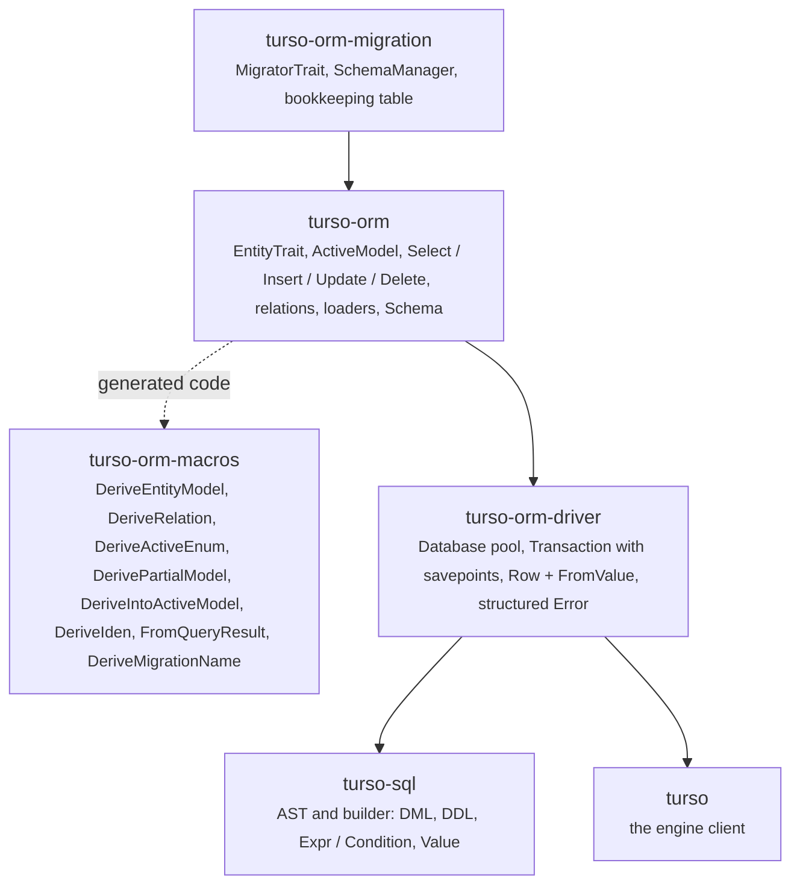

# Design

turso-orm is an ORM for one engine, written from scratch. This page records
the layering and the decisions that differ from a multi-database ORM, each in a sentence,
with a link to the guide page that shows it in use.

## Layers

Each crate depends only on the ones below it. `turso-sql` has no runtime
dependency and binds parameters as the five SQLite storage classes.

## Decisions

**One dialect.** `turso-sql` renders SQLite SQL plus the Turso extensions
(`ALTER COLUMN ... TO`, `STRICT`, `WITHOUT ROWID`, `CREATE INDEX ... USING`,
vector and full-text functions, `BEGIN CONCURRENT`). There is no backend enum
anywhere in the stack, and no second code path to keep honest.

**Decode by requested type.** `Row` keeps raw storage values; `FromValue`
converts on access with SQLite's own leniency, and `Option<T>` maps `NULL`
only, so a wrong type is an error rather than a silent `None`.
See [Entities](../guide/entities.md#column-types).

**One task per connection.** `Database` hands out connections created with
`connect()`, never clones, and every statement holds one for its duration;
with the serverless client a connection is a server-side session, pooled
the same way;
`Transaction` pins one connection and nests through savepoints, with a
deferred `ROLLBACK TO` because `Drop` cannot await.
See [Transactions](../guide/transactions.md).

**Errors are classified once.** `turso::Error` carries text, so the driver
classifies constraint kinds and busy conditions in a single place and the
ORM forwards `is_unique_violation`, `is_foreign_key_violation` and
`is_busy`. See [Handling errors](../guide/queries.md#handling-errors).

**Relations are data.** A `RelationDef` is a plain description of two
column lists; the same value renders the `JOIN ... ON`, drives the loaders
and emits the foreign key. A many-to-many relation is two of them, a
`Linked` chain any number, and a table joined twice is aliased by the
select builder rather than by the user. One `Related<Target>` impl per
entity is a Rust constraint, so a second relation to the same table is
used through its definition. See [Relations](../guide/relations.md).

**Schema from entities.** `TursoType` gives each field a logical column
type, the DDL writes the four storage types so that tables are
`STRICT`-compatible, foreign keys come from `belongs_to` and indexes from
`indexed`. See [Migrations](../guide/migrations.md#starting-from-the-entities).

**Migrations are atomic.** SQLite DDL is transactional, so each migration
runs with its bookkeeping row inside `BEGIN IMMEDIATE`; a failure leaves no
partial schema. See [Migrations](../guide/migrations.md).

**Why not a backend for a multi-database ORM.** Their driver layers are
private and their row types decode with exact-variant conversions that
SQLite's storage classes cannot satisfy; every Turso feature would have to be
smuggled through an abstraction that does not want it. A stack built for one
engine is smaller and exposes the engine as it is.

## Turso 0.8.1 behaviour worth knowing

- One active write statement per connection, and a connection must not be
  shared between tasks. The pool enforces this.
- `PRAGMA journal_mode = 'mvcc'` enables `BEGIN CONCURRENT`; write conflicts
  surface at commit as busy errors.
- `CREATE VIEW IF NOT EXISTS` is not idempotent. `PRAGMA defer_foreign_keys`
  and `foreign_key_check` are unsupported. `WITHOUT ROWID` and generated
  columns are experimental, behind `ConnectOptions::experimental`.
- `turso::sync` returns the same `Connection` type for embedded replicas
  (`ConnectOptions::sync`). `turso_serverless` has its own types; the
  driver keeps both behind one internal connection enum and converts rows
  to the SQL layer's `Value`, so nothing above the driver sees which engine
  answered.
